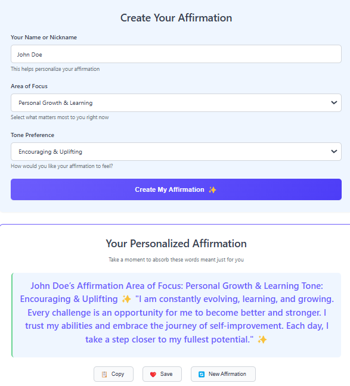

## <span class="logo-icon"></span>
# AffirmAI 🌟

AffirmAI is a web application that generates personalized daily affirmations based on your name and chosen area of focus. Powered by AI, it creates unique and meaningful affirmations to help boost your day.

## Features

- **Personalized Affirmations**: Get affirmations tailored to your name and specific needs
- **Multiple Focus Areas**: Choose from career, health, relationships, personal growth, creativity, and finances
- **Simple Interface**: Easy-to-use design that works on both desktop and mobile
- **One-Click Copy**: Easily copy your affirmation to share or save for later

## Screenshot (different from template)



## Installation

### Prerequisites

- Python 3.7+
- OpenAI API key (You can get one at [OpenAI Platform](https://platform.openai.com/))

### Setup

1. Clone the repository:
   ```
   git clone https://github.com/yourusername/AffirmAI.git
   cd AffirmAI
   ```

2. Create and activate a virtual environment (optional but recommended):
   ```
   python -m venv venv
   source venv/bin/activate  # On Windows, use: venv\Scripts\activate
   ```

3. Install the required packages:
   ```
   pip install -r requirements.txt
   ```

4. Create a `.env` file in the project root directory with your OpenAI API key:
   ```
   OPENAI_API_KEY=your_api_key_here
   ```

5. Run the application:
   ```
   python app.py
   ```

6. Open your browser and navigate to `http://localhost:5000`

## How It Works

1. Enter your name in the form
2. Select your area of focus from the dropdown menu
3. Click "Generate My Affirmation"
4. View your personalized affirmation
5. Copy it or generate a new one

## Technologies Used

- **Backend**: Python, Flask
- **Frontend**: HTML, CSS, JavaScript
- **AI Integration**: OpenAI GPT-3.5 Turbo
- **Styling**: Custom CSS with responsive design

## Customization

You can easily customize the affirmation generation by modifying the prompt in `app.py`. Look for the `openai.ChatCompletion.create` function call and adjust the prompt to suit your needs.

## Contributions
Contributions are welcome! Please feel free to submit a Pull Request.

1. Fork the repository
2. Create your feature branch (`git checkout -b feature/amazing-feature`)
3. Commit your changes (`git commit -m 'Add some amazing feature'`)
4. Push to the branch (`git push origin feature/amazing-feature`)
5. Open a Pull Request

## License

This project is licensed under the MIT License - see the [LICENSE](LICENSE) file for details.

## Acknowledgments

- OpenAI for providing the API that powers our affirmations
- The Flask team for the lightweight web framework
- All contributors and users of AffirmAI

---

Made with ❤️ by Doudol
